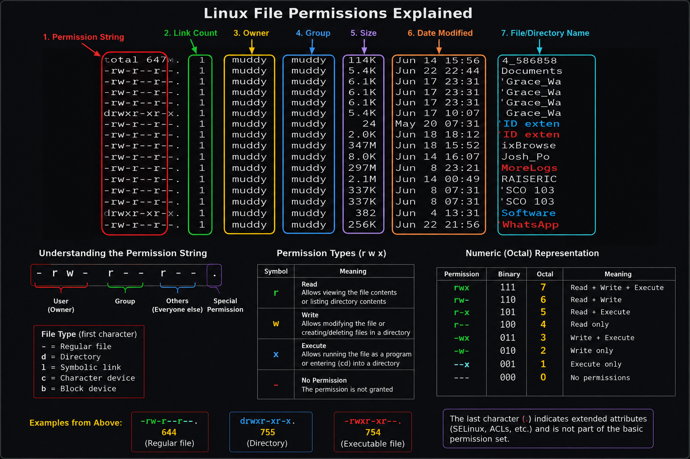

# Bash Basics
## Introduction
Bash (Bourne Again Shell) is acommand-line interpreter commonly used in Linux and Unix-based operating systems. It allowa users to interactwith the operating system by typing commands instead of using a graphical interface. Bash provides a fast and efficient way to:  
navigate directories,  
manage files,  
automate taks,  
and administer systems.  

Learning basic Bash commands is an essential skill for linux users, system administsrators, software developers and cybersecurity professionals. Understanding commands such as `ls`, `cd`, `pwd`, and `mkdir` help users navigate the file system, inspect directory conteents and work more effecively in aterminal environment. This guide introduces fundamental Bsh commands and their commonly used options.  

---
## 1. The `ls` Command
### i. Purpose
- List files and directories.
- Helps inspet folder contents.
- Can display hidden files and permissions.

### ii. Basic Syntax

---
| Command | Description/ Function | Example |
|-------------|---------------------| ------|
| `-l` | Long listing | `ls -l` |
| `-a` | Show hidden files | `ls -a`|
| `-h` | Human-readable sizes | `ls -h` |
| `-t` | Sort by modification time | `ls -t` |
| `-r` | Reverse Sorting | `ls -r` | 
| `-R` | List subdirectories recursively | `ls -R`|
| `-S` | Sort by file size | `ls -S` |
| `-1` | one file per line | `ls -1` | 
| `-d` | list directories themselves not their token | `ls -d` |
| `-F` | Append file indicators | `ls -F` | 
| `--color=auto` | Colorized ooutput | `ls --color=auto` |

---
### iii. Combining Options
```bash
ls -lah
```
[] Breakdown
- l => long listing
- a => list including hidden files
- h => human-readable sizes

### iv. Understanding Hidden Files
- Hidden files start with `.`
- Examples:
        - `.baashrc`
        - `.gitignore`
        - `.profile`
- Command example:
 ```bash
 ls -a
 ```
 ---
 ## 2.Directory Navigation `cd`
 ### i. Purpose
 - it is used to change/ navigate through directories
 ### ii. Common Commands

 | Command | Meaning |
 |------| ------- |
 | `cd` | Go to home directory |
 | `cd ~` | Go to home directory | 
 | `cd ..` | Move one level up |
 | `cd - ` | switch to previous directory| 
 | `cd / ` | Change to Root Directory | 
 | `cd foldername` | Enter a folder |

 ---

 ## 3. The `pwd` command
 ### i. Purpose
 - it shows hte current working directory.

 | Command | Meaning |
 |-----------|---------|
 | `pwd -l` | Displays the logical current working directory. |
 | `pwd -P` | Displays the physical current working directory.|
 
 ---

 ## 4. The `echo ` command
 ### i. Purpose
 - Used to show a line of text or variables in the terminal.

 | Command | Meaning |
 |----------|----------|
 | `echo -n` | Dont add  a  new line at the end |
 | `echo -e` | Allows special  characters ie. `\n` for new lines |
 | `echo -E` | Don't  allow special characters (Default)|

 ---

 ## 5. The `cat` Command
 ### i. Purpose
 - Used to show the contents of a file in a terminal.
 - It can also be used to combine multile files

 ### ii. Basic usage
 ```bash
 cat filename
 ```
 | Command | Meaning |
 |---------|-------------|
 | `cat -n` | Add numbers to each line |
 | `cat -b` | Add numbers only to lines with text |
 | `cat -s` | Remove extra lines |
 | `cat -v` | Show non-printing characters(Except for tabs and end of lines) |

 ---

 ## 6. The `cp` Command
 ### i. Purpose
 - Used to copy  files and directories from one location to another.
 ### ii. Basic usage
 ```bash
 cp source_file destination_file
 ```
 | Command | Meaning |
 |-------------|---------|
 | `cp -r` | Copy all files and folders in a directory |
 | `cp -i` | Ask  before replacing files |
 | `cp -u` | Copyonly if the source is newer |
 | `cp -v` | Verbose mode, show files being copied|

 ---

 ### iii. `cp` with  wildcards
 ```bash
 cp *.txt /destination/
 ```
 - it is used to copymultiple files.

 ## 7.The `mv` command
 ### i. Purpose
 - It is used to move files and directories
 - It is  also used to rename files and directories.
 ### ii. Basic usage
 ```bash
 mv source_file destination_file
 ```
 or 
 ```bash
 mv old_filename new-filename
 ```
 when renaming a file or directory
 ---
 | Command | Meaning |
 |----------|-----------|
 | `mv -i` | Ask before replacing |
 | `mv -u` | Move only if the source is newer |
 | `mv -v` | Verbose mode, Show files or directories being moved |

 ### iii. `mv` with wildcards
 ```bash
 mv *.txt /destination/
 ```
 - it used to move multiple files.

## 8. The `rm` Command
### i. Purpose
- Used to remove files or directtories
### ii. Basic  usage
```bash
rm filename
```

| Command | Meaning | 
|-----------|--------|
| `rm -r` | Delete a folser and everything inside it. |
| `rm -i` | Ask before deleting files |
| `rm -f` | Force deleting without asking |
| `rm -v` | Verbose mode,  Show  the files/foldersbeing deleted|

---

```bash
rm *.class 
```
- This Deletes all the files with a .class extension inside the current directory.

## The `touch` Command
### i.  Purpose
- Used to change the time stamps or create an empty file if it does not exist.

### ii. Basic usage
```bash
touch filename
```
| Command | Meaning |
|-----------|---------|
| `touch -a` | update only when the file was last used |
| `touch -m` | Update only when the file was last changed |
| `touch -t` | Set the timestamp to a specific time `touch -t 202601010000 test.txt` |
| `touch -c` | Do not create any files |

---

## 9. The `mkdir` Command
### i.Purpose
- Used to create new directories 

```bash
mkdir folder_name
```
| Command | Meaning |
|-----------|-----------|
| `mkdir -p` | Parent direcories as needed |
| `mkdir -v` | Show a message for each created directory |
| `mkdir -m` | set file  permission ```bash  mkdir -m 755 ``` |



---

## 10. The `man`  Command
### i.Purpose
- Used to display the user manual of any command that can be run on terminal

```bash
man command_name
```
[] ie. `man ls`

---
## 11. Bash `alias`
### i. Purpose
- it allows a user to create a shortcut for a long or frequently used command
- This makes it easy to execute complex commands with a simple keyword

```bash
alias name='command'
```
[] name is the shortcut name you want to use.  
[] command is the full command you want to execute

----
-for removing an alias:
```bash
unalias name
```
------------------------------------------------------------------------------------


